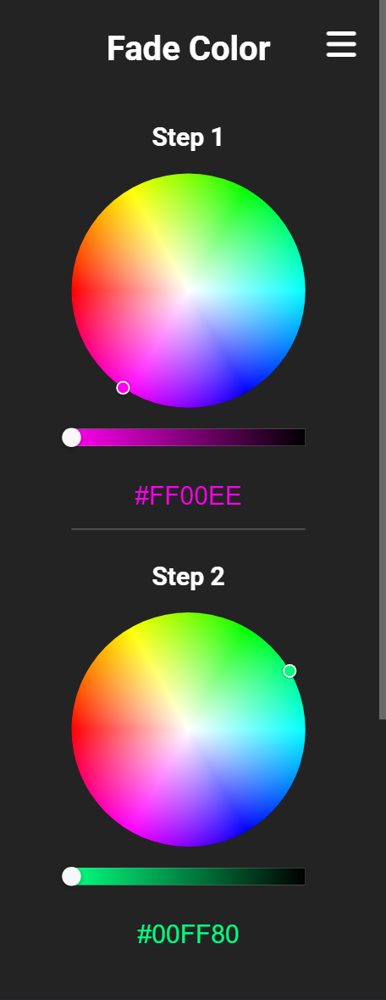
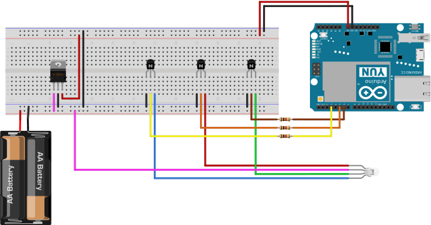

# RGB LED Strip Controller

This project uses an Arduino Yùn microcontroller to controll an RGB LED Strip with an external powersupply and hosts a web interface built with React on the Yùn`s Linux webserver.

## Supported Modes

| <div style="width:auto">Static Color Mode</div> | <div style="width:auto">Breathing Color Mode</div>| <div style="width:auto">Fade Colors Mode</div>|
| :---------------------------------------: | :-------------------------------------: | :-------------------------------------: |
| <br/> Displays a static color on the LED Strip. <br/><br/> <br/><br/><br/><br/><br/><br/> | <br/>Applys a breathing effect to a static color. Slowly dims and brightens the selected color. <br/><br/> <br/><br/><br/><br/><br/> | <br/> Fades from one color to another. Supports up to 6 chained color steps (Fades from 1->2->3->4->5->6->1->2->...) <br/><br/>  |

## Arduino Circuit

### Components
- 1x **Arduino Yùn** (I used a Yùn to controll the LED Strip on a web interface, but any Arduino with 3 analog pins can be used, if you don`t need the web interface)
- 3x **npn Transistors** (i used 2N2222A)
- 3x **1kΩ Resistors** (used to limit the current into the transistors, this will vary on YOUR LED Strips Voltage and Resistance - best you use an online calculator)
- 1x **5V Voltage Regulator** (the Arduino Yùn does not have a voltage regulator built in, so i needed one to convert my 12V LED Strip Input voltage - but you can also use 2 power supplies, one for the LED Strip and one for your arduino)
- 1x **LED Strip and Power Supply**

### Wiring Diagram
- Pin 5: Red LED
- Pin 6: Green LED
- Pin 3: Blue LED

**Note**: This circuit uses a **Common Anode RGB LED** - that means VCC (+, Voltage) is supplied directly to the LED, while GND (Ground) is connected to every R,G and B LED seperatly. If your LED uses a **Common Kathode** make sure to swap the GND and VCC lines in this diagram.



[Fritzing File](docs/Circuit.fzz)


## Web interface

The Arduino Yùn setup guide can be found here: [Getting Started with the Arduino Yún | Arduino Docs](https://docs.arduino.cc/retired/getting-started-guides/ArduinoYun/)

This Arduino Sketch requires the following Packages:
- Bridge
- BridgeServer
- BridgeClient

Upload the [Arduino Sketch](RGB-LED-STRIP-CONTROLLER.ino) to your Arduino Yùn using the ARV ISP programmer and copy the `arduino` folder inside the `dist` folder onto your Yùn´s SD-Card.

The Arduino Webserver is hosted at `http://[YOUR ARDUINO IP]/sd/`.

## Modification

This web interface is build with React & TypeScript and needs to be bundled using webpack.

**Make sure you have Node.js and NPM installed.**

Install Node.js Packages using npm.
```bash
npm install
```

### Start dev server for testing. 

You also need to add your Arduinos IP Address in the dev server proxy settings in the `webpack.dev.js` config.
```bash
npm run dev
```

### Build HTML, CSS and JavaScript bundle for the Yùn web interface. 

Copy the `arduino` folder inside the `dist` folder onto your Yùn´s SD-Card and the Arduino Webserver will host it for you at `http://[YOUR ARDUINO IP]/sd/`.
```bash
npm run build
```

# Planned Features (SoonTM)

- Timing Settings (Breathing speed, Fade duration, ...)
- Native Rainbow Mode
- Flickering Mode

# License
Licensed under the MIT License.